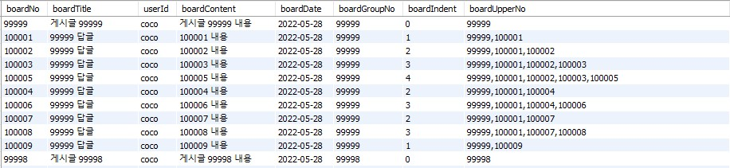
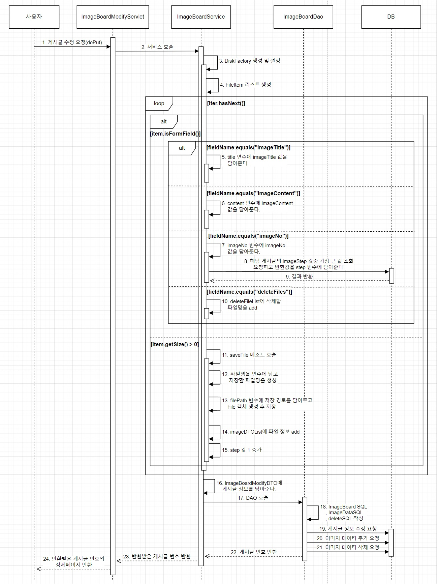

# BoardProejct Servlet&JSP ver.

## 의도
Servlet&JSP로 구현해본적이 없기에 간단한 게시판 형태의 구현을 목표로 진행.

## 프로젝트 기능
* 계층형 게시판
	* 계층형 구조로 텍스트만으로 구성된 게시판
	* 게시글 검색, 페이징, 작성, 수정, 삭제, 답글, 댓글 기능 구현
	* 계층형 구조이므로 게시글 삭제 시 해당 게시글 하위 계층에 위치하는 게시글도 같이 삭제되도록 구현
* 이미지 게시판
	* 이미지와 텍스트를 같이 업로드 할 수 있는 게시판
	* 최대 5장의 이미지 파일 업로드 가능
	* 검색, 페이징, 작성, 수정, 삭제, 댓글 기능 구현
	* 여러 방법으로 수행해보기 위해 삭제는 관리자만 가능하도록 구현
* 댓글
	* 계층형 구조로 구현
	* 계층형 게시판과 마찬가지로 삭제 시 하위 계층에 위치하는 모든 댓글도 같이 삭제
	* 댓글의 경우 delete 처리를 하는것이 아닌 update로 status값을 변경해 '삭제된 댓글입니다'라는 문구를 출력하도록 구현
	* status 값에 다른 content의 내용은 Front에서 parsing하는 것이 아닌 Query로 처리.
 

## 개발 환경
* IDE - Eclipse
* Java 8
* MySQL 8.0
* JDBC
* BootStrap
* Library
	* gson-2.8.9
	* commons-fileupload-1.5
	* commons-io-2.11.0
	* jstl lib
		* taglibs-standard-impl-1.2.5
		* taglibs-standard-spec-1.2.5


## 기능

### Servlet 구조

처음에는 Sevlet에서 doGet, doPost, doPut등 메소드들을 오버라이드해서 처리하고자 했으나 그렇게 처리하는 경우 기능별로 Servlet을 분리해서 나누는 것이 좋을지, 아니면 Spring에서 Controller처럼 하나의 큰 틀에서 기능을 메소드별로 나누는 것이 좋을지에 대한 정보가 부족해 확신이 없었습니다.   
그래서 여러 방법으로 Sevlet 구조를 설계해 봤습니다.

CommentServlet과 MemberServlet은 doGet, doPost 메소드들을 일체 사용하지 않고, service 메소드에서 요청 uri에 따라 직접 작성한 메소드를 호출하는 형태로 처리합니다.
```java
@WebServlet(urlPatterns = "/comment/*")
public class CommentServlet extends HttpServlet {
	private static final long serialVersionUID = 1L;

	private CommentService comemntService = new CommentServiceImpl();

	@Override
	protected void service(HttpServletRequest req, HttpServletResponse resp) throws ServletException, IOException {
		String uri = req.getRequestURI();
		String path = uri.substring(uri.lastIndexOf("/"));

		if(path.equals("/boardComment"))
			doGetBoardComment(req, resp);
		else if(path.equals("/imageComment"))
			doGetImageBoardComment(req, resp);
		else if(path.equals("/commentInsert"))
			doPostInsertComment(req, resp);
		else if(path.equals("/commentDelete"))
			doDeleteComment(req, resp);
		else if(path.equals("/commentReply"))
			doPostReplyComment(req, resp);
	}

	protected void doPostReplyComment(HttpServletRequest req, HttpServletResponse resp) throws ServletException, IOException {
		String result = commentService.commentReply(req);

		PrintWriter out = resp.getWriter();
		out.print(result);
	}

	protected void doGetBoardComment(HttpServletRequest req, HttpServletResponse resp) throws ServletException, IOException {
		CommentDTO dto = commentService.getBoardComment(req);

		resp.setContentType("application/json")
		resp.setCharacterEncoding("UTF-8");

		String gson = new GsonBuilder().setDateFormat("yyyy-MM-dd").create().toJson(dto);

		resp.getWriter().write(gson);
	}

	...
}
```

계층형 게시판인 HierarchicalBoardServlet은 Comment와 Member같이 service 메소드를 통해 요청을 먼저 받게 되지만 모든 메소드를 직접 작성하는 것이 아닌 doGet, doPost 메소드를 오버라이드해 처리하면서 추가적으로 필요한 기능에 대한 메소드를 직접 작성해 호출하도록 처리했습니다.
```java
@WebServlet(urlPatterns = "/board/*")
public class HierarchicalBoardServlet extends HttpServlet {
	private static final long serialVersionUID = 1L;

	private HierarchicalBoardService boardService = new HierarchicalBoardServiceImpl();

	@Override
	protected void service(HttpServletRequest req, HttpServletResponse resp) throws ServletException, IOException {
		String uri = req.getRequestURI();
		String path = uri.substring(uri.lastIndexOf("/"));

		if(path.equals("/boardList"))
			doGet(req, resp);
		else if(path.equals("/boardDetail"))
			doGetDetail(req, resp);
		else if(path.equals("/boardModifyProc"))
			doPut(req, resp);
		else if(path.equals("/boardDelete"))
			doDelete(req, resp);
		else if(path.equals("/boardInsertProc"))
			doPost(req, resp);
		else if(path.equals("/boardInsert"))
			doGetInsert(req, resp);
		else if(path.equals("/boardModify"))
			doGetModify(req, resp);
		else if(path.equals("/boardReply"))
			doGetReply(req, resp);
		else if(path.equals("/boardReplyProc"))
			doPostReply(req, resp);
	}

	@Override
	protected void doGet(HttpServletRequest req, HttpServletResponse resp) throws ServletException, IOException {
		RequestDispatcher dispatcher;

		List<HierarchicalBoard> resultList = boardService.boardList(req, resp);
		
		if(resultList == null){
			req.setAttribute("list", null);
			dispatcher = req.getRequestDispatcher(ViewPathProperties.accessErrorViewPath);
		}else {
			req.setAttribute("list", resultList);
			req.setAttribute("pageMaker", boardService.setPageDTO(req));
			dispatcher = req.getRequestDispatcher(ViewPathProperties.hierarchicalViewPath + "boardList.jsp");
		}
		dispatcher.forward(req, resp);
	}

	protected void doPostReply(HttpServletRequest req, HttpServletResponse resp) throws ServletException, IOException {
		RequestDispatcher dispatcher;

		long result = boardService.boardReply(req, resp);

		if(result == 0){
			dispatcher = req.getRequestDispatcher(ViewPathProperties.accessErrorViewPath);
			dispatcher.forward(req, resp);
		}else
			resp.sendRedirect("/board/boardDetail?boardNo=" + result);
	}

	...
}
```

마지막으로 이미지 게시판은 기능별로 Servlet을 모두 분리하고 service 메소드를 일체 사용하지 않은 구조로 doGet, doPost, doPut 등의 메소드들을 오버라이드해 구현하는 방법으로 처리했습니다.

|Servlet|Method|
|---|---|
|ImageAttachServlet|doGet - 이미지 수정 페이지에서 해당 게시글의 이미지 데이터를 반환|
|ImageBoardDeleteServlet|doDelete - 게시글 삭제 처리|
|ImageBoardDetailServlet|doGet - 이미지 게시판 상세페이지 데이터를 담아 호출|
|ImageBoardInsertServlet|doGet - 이미지 게시판 작성 페이지 호출 <br/> doPost - 이미지 게시판 작성 요청 처리|
|ImageBoardModifyServlet|doGet - 이미지 게시판 수정 페이지 데이터를 담아 호출 <br/> doPut - 이미지 게시판 수정 요청 처리|
|ImageBoardServlet|doGet - 이미지 게시판 리스트(메인) 페이지 요청|
|ImageServlet|doGet - 이미지 출력을 위한 처리|

Servlet을 이렇게 분리함으로써 Servlet이 어떤 기능을 담당하고 있는지, 이 Servlet에서는 어떤 Http Method 요청을 처리하고 있는지 좀 더 명확하고 빠르게 알 수 있다는 장점이 있었습니다.

아쉽게도 여러가지 방법으로 Servlet을 분리해봤지만 아직은 어떤 방법이 더 좋을지에 대한 확신이 서지 않았습니다.   
작은 프로젝트들을 개인 프로젝트로 수행하고 리팩토링하고 있다보니 감을 잡는데 어려움이 있지만,   
이 경험으로 느낄 수 있었던 것은 다른 Servlet들 처럼 큰 틀의 Servlet을 하나 만들어두고 사용하는 것 보다는 좀 더 분리하는 것이 좋다는 생각이 들었습니다.   

대신 이미지 게시판처럼 완전한 분리를 통한 설계보다는 좀 더 Servlet의 네이밍을 명확하게 하고 관심사별로 나눌 수 있도록 설계하는 방법이 좋지 않을까 라는 생각을 할 수 있었습니다.

### JDBC

일정한 Connection을 반환 받기 위해 JDBCTemplate 클래스를 생성하고 Connection을 반환하도록 했으며,   
close, rollback, commit을 처리하는 메소드와 ResultSet, Statement의 close를 처리하는 메소드를 작성해 두었습니다.


```java
public class JDBCTemplate {
	
	public static Connection getConnection() {
		try {
			Class.forName("com.mysql.cj.jdbc.Driver");
		}catch(ClassNotFoundException e) {
			e.printStackTrace();
		}
		
		String url = "jdbc:mysql://localhost:3306/boardproject?serverTimezone=UTC&characterEncoding=UTF-8&autoReconnection=true";
		String id = "root";
		String pw = "1234";
		
		Connection con = null;
		
		try {
			//뭔지 알아보기.
			con = DriverManager.getConnection(url, id, pw);
			
			con.setAutoCommit(false);
		}catch(SQLException e) {
			e.printStackTrace();
		}
		
		return con;
	}
	
	//연결 상태라면 true, 닫혀있다면 false 리턴.
	public static boolean isConnection(Connection con) {
		boolean valid = true;
		
		try {
			// con이 null이거나 con이 close 상태라면
			if(con == null || con.isClosed()) {
				valid = false;
			}
		}catch(SQLException e) {
			valid = true;
			e.printStackTrace();
		}
		
		return valid;
	}
	
	//연결 상태인지 아닌지 확인 후 연결 상태라면 close
	public static void close(Connection con) {
		if(isConnection(con)) {
			try {
				con.close();
			}catch(SQLException e) {
				e.printStackTrace();
			}
		}
	}
	
	//statement가 null이 아닐 때 close
	public static void close(Statement stmt) {
		if(stmt != null) {
			try {
				stmt.close();
			}catch(SQLException e) {
				e.printStackTrace();
			}
		}
	}
	
	//rs가 null이 아닐 때 close
	public static void close(ResultSet rs) {
		if(rs != null) {
			try {
				rs.close();
			}catch (SQLException e) {
				e.printStackTrace();
			}
		}
	}
	
	//연결 상태라면 commit
	public static void commit(Connection con) {
		if(isConnection(con)) {
			try {
				con.commit();
			}catch(SQLException e) {
				e.printStackTrace();
			}
		}
	}
```

### 계층형 게시판

* 테이블 구조
  
  <br/>
  <br/>
  데이터베이스는 기존 BoardProject의 데이터베이스를 그대로 사용했습니다.
  GroupNo로 계층형 구조의 그룹화를 처리하고, UpperNo에는 최상위 글부터 자신까지의 경로에 있는 글 번호, Indent로 계층을 표현했습니다.
  이 구조를 통해 GroupNo 내림차순, UpperNo 오름차순으로 정렬해 간단하게 계층형 구조를 처리할 수 있었습니다.

  <br/>
  <br/>
  
* 게시판 리스트 조회   
  게시판에는 페이징 기능이 적용되어 있어 20개씩 조회하며, 검색 기능이 존재합니다.
  검색 타입으로는 제목, 내용, 작성자, 제목 + 내용 이렇게 4가지의 타입으로 검색할 수 있습니다.
  이 조건을 처리하기 위해 타 버전에서 동적쿼리를 수행했던 것 처럼 JDBC를 통한 처리 역시 동일하게 처리할 수 있도록 했습니다.
  <br/>
  <br/>

  ```java
  public class HierarchicalBoardDaoImpl implements HierarchicalBoardDao {

	private Connection con = null;
	
	@Override
	public List<HierarchicalBoard> boardList(Criteria cri) {
		
		con = JDBCTemplate.getConnection();
		
		String sql = "SELECT * "
				+ "FROM hierarchicalBoard";
		
		if(cri.getSearchType() != null)
			sql = setSearchSQL(cri.getSearchType(), cri.getKeyword(), sql);
		
		
		sql = sql.concat(" ORDER BY boardGroupNo desc, boardUpperNo asc "
							+ "limit " + ((cri.getPageNum() - 1) * cri.getBoardAmount()) + ", " + cri.getBoardAmount());
		
		List<HierarchicalBoard> boardList = new ArrayList<HierarchicalBoard>();
		
		PreparedStatement pstmt = null;
		ResultSet rs = null;
		
		try {
			pstmt = con.prepareStatement(sql);
			rs = pstmt.executeQuery(sql);
			
			while(rs.next()) {
				
				boardList.add(new HierarchicalBoard.HierarchicalBoardBuilder()
						.boardNo(rs.getLong("boardNo"))
						.boardTitle(rs.getString("boardTitle"))
						.userId(rs.getString("userId"))
						.boardContent(rs.getString("boardContent"))
						.boardDate(rs.getDate("boardDate"))
						.boardGroupNo(rs.getLong("boardGroupNo"))
						.boardIndnet(rs.getInt("boardIndent"))
						.boardUpperNo(rs.getString("boardupperNo"))
						.build()
						);
			}
			
		}catch(SQLException e) {
			e.printStackTrace();
			return null;
		}finally {
			JDBCTemplate.close(con);
			JDBCTemplate.close(pstmt);
			JDBCTemplate.close(rs);
		}
		
		
		return boardList;
	}

  	public String setSearchSQL(String searchType, String keyword, String sql) {
		
		if(searchType != null) {
			switch(searchType) {
			case "t" :
				sql = sql.concat(" WHERE boardTitle LIKE '%" + keyword + "%'");
				break;
			case "c" :
				sql = sql.concat(" WHERE boardContent LIKE '%" + keyword + "%'");
				break;
			case "w" :
				sql = sql.concat(" WHERE userId LIKE '%" + keyword + "%'");
				break;
			case "tc" :
				sql = sql.concat(" WHERE boardTitle LIKE '%" + keyword + "%' or boardContent LIKE '%" + keyword + "%'");
				break;
			}
		}
		
		return sql;
	}

  ...
  }
  ```
  <br/>
  <br/>
  DAO에서 검색 타입에 대한 조건문을 통해 검색 요청이라면 setSearchSQL 메소드를 호출해 WHERE문을 추가할 수 있도록 했습니다.

  <br/>
  <br/>
  
* 게시글 삭제
  <br/>
  계층형에서 게시글을 삭제하는 경우 하위 게시글까지 삭제하게 됩니다.
  원글의 경우 같은 GroupNo를 가진 모든 데이터를 삭제하도록 하는 방법으로 간단하게 처리할 수 있지만, 중간에 위치한 답글을 삭제하는 경우에는
  해당 글의 하위글만 찾아 삭제하도록 처리할 필요가 있었습니다.

  <br/>
  <br/>

  ```java
  //HierarchicalBoardService
  @Override
  public String boardDelete(HttpServletRequest request, HttpServletResponse response) {
	
  	long boardNo = Long.parseLong(request.getParameter("boardNo"));
  	HttpSession session = request.getSession();
  	String uid = (String) session.getAttribute("id");
	
	if(!boardDAO.checkWriter(boardNo).equals(uid))
		return null;
	
	//삭제요청 게시글의 no, gno, upper, indent를 요청
	HierarchicalBoardDeleteDTO deleteDTO = boardDAO.checkDeleteNo(boardNo);
	
	//삭제 요청 게시글의 indent가 0이라면 boardNo를 gno로 넘겨 해당 그룹 전체 삭제
	if(deleteDTO.getBoardIndent() == 0)
		boardDAO.deleteBoardGroup(boardNo);
	else { //indent가 0이 아닌 경우 답글이기 때문에
		//같은 그룹의 모든 데이터를 요청하고
		List<HierarchicalBoardDeleteDTO> deleteGroupDTO = boardDAO.getDeleteGroup(deleteDTO.getBoardGroupNo());
		
		//그룹 내에서 upperNo에 boardNo가 들어있는 리스트를 만들어서
		List<Long> deleteNoList = new ArrayList<Long>();
		getDeleteData(deleteGroupDTO, boardNo, deleteDTO.getBoardIndent(), deleteNoList);
		
		//list를 삭제 요청
		boardDAO.boardDelete(deleteNoList);
		
	}
	
	return "success";
  }

  public void getDeleteData(List<HierarchicalBoardDeleteDTO> deleteGroupDTO, long boardNo
							, int boardIndent, List<Long> deleteNoList) {
	
	for(int i = 0; i < deleteGroupDTO.size(); i++) {
		String upperNo = deleteGroupDTO.get(i).getBoardUpperNo();
		String[] upperArr = upperNo.split(",");
		
		if(upperArr.length > boardIndent && boardNo == Long.parseLong(upperArr[boardIndent])) 
			deleteNoList.add(deleteGroupDTO.get(i).getBoardNo());
		
	}		
	
  }
  ```
  <br/>
  삭제 데이터를 찾는 방법으로는 UpperNo의 값들을 split()으로 배열화 해준 뒤 삭제하고자 하는 데이터의 Indent 위치에 글 번호가 존재한다면,
  삭제해야하는 데이터라고 판단할 수 있습니다.
  이 조건에 해당하는 데이터의 글 번호들을 리스트화 한 뒤, 삭제요청에 리스트를 담아 전달하도록 했습니다.

  <br/>
  
  ```java
  @Override
  public String boardDelete(List<Long> deleteNoList) {
	String sql = "DELETE FROM hierarchicalBoard WHERE boardNo IN (%s)";
	String inSql = String.join(",", Collections.nCopies(deleteNoList.size(), "?"));
	sql = String.format(sql, inSql);
	con = JDBCTemplate.getConnection();
	PreparedStatement pstmt = null;
	
	try {
		pstmt = con.prepareStatement(sql);
		for(int i = 1; i <= deleteNoList.size(); i++) 
			pstmt.setLong(i, deleteNoList.get(i - 1));
		
		pstmt.executeUpdate();
		
		JDBCTemplate.commit(con);
		
	}catch(SQLException e) {
		e.printStackTrace();
		
		JDBCTemplate.rollback(con);
		
		return null;
	}finally {
		JDBCTemplate.close(con);
		JDBCTemplate.close(pstmt);
	}
	
	
	return "success";
	
  }
  ```
  
  <br/>
  <br/>

  DAO에서는 List로 받은 데이터를 처리하기 위해 IN 절을 통해 처리했습니다.
  리스트의 사이즈는 매번 동일하지 않기 때문에 달라지는 사이즈를 감안해 Collections.nCopies를 통해 동적으로 처리할 수 있도록 했습니다.

  <br/>
  <br/>

### 이미지 게시판(수정)

<br/>

<br/>
Spring에서 파일 처리는 Multipart와 String의 리스트로 받아 쉽게 처리할 수 있었지만 Servlet에서는 사용할 수 없었기에 다른 방법이 필요했습니다.   
문제 해결을 위해 여러 방법을 찾아보게 되었고, 전통적인 자바에서 파일 처리 방식과 DiskFileItemFactory, FileItem을 통한 처리 방식을 찾을 수 있었습니다.   
그 중에서 DisFileItemFactory와 FileItem을 통한 처리 방법을 택해 문제를 해결할 수 있었습니다.
<br/>
  
```java
@Override
public long modify(HttpServletRequest request) {
	
	String title = null;
	String content = null;
	String imageNo = null;
	List<String> deleteFileList = new ArrayList<String>();
	List<ImageDataDTO> imageDTOList = new ArrayList<ImageDataDTO>();
	ImageBoardModifyDTO dto = new ImageBoardModifyDTO();
	HttpSession session = request.getSession();
	String uid = (String) session.getAttribute("id");
	
	int step = 0;
	
	
	try {
		DiskFileItemFactory diskFactory = new DiskFileItemFactory();
		diskFactory.setSizeThreshold(4096);
		diskFactory.setRepository(new File(FileProperties.TEMP_PATH));
		
		ServletFileUpload upload = new ServletFileUpload(diskFactory);
		
		upload.setSizeMax(FileProperties.FILE_SIZE);
		
		List<FileItem> items = upload.parseRequest(request);
		
		Iterator<FileItem> iter = items.iterator();
		
		while(iter.hasNext()) {
			FileItem item = (FileItem) iter.next();
			
			if(item.isFormField()) {
				String fieldName = item.getFieldName();
				
				if(fieldName.equals("imageTitle"))
					title = item.getString("UTF-8");
				else if(fieldName.equals("imageContent"))
					content = item.getString("UTF-8");
				else if(fieldName.equals("imageNo")) {
					imageNo = item.getString("UTF-8");
					step = imageBoardDAO.getStep(Long.parseLong(imageNo)) + 1;
					
					if(step == 1)
						throw new Exception();
				}else if(fieldName.equals("deleteFiles"))
					deleteFileList.add(item.getString("UTF-8"));
				
			}else {
				if(item.getSize() > 0) 
					saveFile(item, imageDTOList, step);
			}
		}
		
	}catch(Exception e) {
		e.printStackTrace();
		return -1;
	}
	
	dto = new ImageBoardModifyDTO.ImageBoardModifyDTOBuilder()
			.imageNo(Long.parseLong(imageNo))
			.imageTitle(title)
			.imageContent(content)
			.userId(uid)
			.build();
	
	long result = imageBoardDAO.modify(dto, imageDTOList, deleteFileList);
	
	if(result == 0)
		return 0;
	else {
		deleteFiles(deleteFileList);
		return result;
	}
	
}

public void saveFile(FileItem item, List<ImageDataDTO> imageDTOList, int step) {
	
	try {
		String name = item.getFieldName();
		String fileName = item.getName();
		
		StringBuffer sb = new StringBuffer();
		String saveName = sb.append(new SimpleDateFormat("yyyyMMddHHmmss").format(System.currentTimeMillis()))
				.append(UUID.randomUUID())
				.append(fileName.substring(fileName.lastIndexOf("."))).toString();
		
		Path filePath = Paths.get(FileProperties.FILE_PATH + "/" + saveName);
		File uploadFile = filePath.toFile();
		item.write(uploadFile);
		
		imageDTOList.add(new ImageDataDTO.ImageDataDTOBuilder()
				.imageName(saveName)
				.oldName(fileName)
				.imageStep(step)
				.build());
		step++;
	} catch (Exception e) {
		// TODO Auto-generated catch block
		e.printStackTrace();
	}
}

public void deleteFiles(List<String> deleteFileList) {
	String filePath = FileProperties.FILE_PATH;
	
	if(deleteFileList.size() != 0) {
		for(int i = 0; i < deleteFileList.size(); i++) {
			String deleteFileName = deleteFileList.get(i);
			File file = new File(filePath + deleteFileName);
			if(file.exists())
				file.delete();
		}
	}
		
}
```

DiskFileItemFactory와 FileItem을 통해 게시글 정보와 파일을 꺼낼 수 있었고, 저장 및 삭제 데이터에 대해서는 리스트화 한 뒤 DAO에 요청하게 됩니다.   

```java
@Override
public long modify(ImageBoardModifyDTO dto, List<ImageDataDTO> imageDTOList, List<String> deleteFileList) {
	con = JDBCTemplate.getConnection();
	PreparedStatement pstmt = null;
	
	String modifySQL = "UPDATE imageBoard SET "
			+ "imageTitle=?"
			+ ", imageContent=? "
			+ "WHERE imageNo=?";
	
	String imageSQL = "INSERT INTO imageData("
			+ "imageName"
			+ ", imageNo"
			+ ", oldName"
			+ ", imageStep) "
			+ "VALUES ";
	String imageValSQL = String.join(",", Collections.nCopies(imageDTOList.size(), "(?, ?, ?, ?)"));
	
	imageSQL = imageSQL.concat(imageValSQL);
	
	
	String deleteImageDataSQL = "DELETE FROM imageData "
			+ "WHERE imageName IN (%s)";
	
	String delteValSQL = String.join(",", Collections.nCopies(deleteFileList.size(), "?"));
	
	deleteImageDataSQL = String.format(deleteImageDataSQL, delteValSQL);
	
	int columnCount = 1;
	
	try {
		pstmt = con.prepareStatement(modifySQL);
		pstmt.setString(1, dto.getImageTitle());
		pstmt.setString(2, dto.getImageContent());
		pstmt.setLong(3, dto.getImageNo());
		
		pstmt.executeUpdate();
		
		pstmt = con.prepareStatement(imageSQL);
		for(int i = 1; i <= imageDTOList.size(); i++) {
			pstmt.setString(columnCount++, imageDTOList.get(i - 1).getImageName());
			pstmt.setLong(columnCount++, dto.getImageNo());
			pstmt.setString(columnCount++, imageDTOList.get(i -1).getOldName());
			pstmt.setInt(columnCount++, imageDTOList.get(i - 1).getImageStep());
		}
		
		pstmt.executeUpdate();
		
		pstmt = con.prepareStatement(deleteImageDataSQL);
		for(int i = 1; i <= deleteFileList.size(); i++)
			pstmt.setString(i, deleteFileList.get(i - 1));
		
		pstmt.executeUpdate();
		
		JDBCTemplate.commit(con);
		
	}catch(SQLException e) {
		e.printStackTrace();
		JDBCTemplate.rollback(con);
		
		return 0;
	}finally {
		JDBCTemplate.close(con);
		JDBCTemplate.close(pstmt);
	}
	
	
	return dto.getImageNo();
}
```
리스트를 전달해 처리하는만큼 여기서도 동적 쿼리로 수행할 수 있어야 했습니다.   
계층형 게시판의 Delete와는 다른 점으로 이미지 데이터의 삽입 과정을 IN 절로 처리할 수 없었기 때문에 동일하게 String.join을 통해 values 구문 부분을 만들어주도록 했습니다.   
그리고 값에 대해서는 PreparedStatement.set 을 통해 담아주도록 했고, 여러건을 처리하기 위해 반복문을 통해 처리했습니다.

처리 과정 중에 게시글 정보, 이미지 데이터 추가, 이미지 데이터 삭제 중 하나라도 문제가 발생한다면 전체적인 롤백이 필요하다고 판단해 하나의 메소드에서 처리하도록 했고,   
문제가 발생하는 경우 catch문을 통해 전체 롤백이 수행되도록 했습니다.

만약 롤백이 되는 경우 저장된 파일이 삭제되었다면 문제가 발생하기 때문에 비즈니스 로직에서 파일 삭제 메소드 호출은 데이터 처리가 완료된 후에 수행하도록 했습니다.


## 프로젝트 특징과 이유, 느낀점
1. Servelet의 분리
	* servlet의 경우 HierarchicalBoardServlet와 CommentServlet, MemberServlet은 하나의 서블릿에서 HierarchicalBoard에 대한 모든 처리를 담당한다.
	* 하지만 ImageBoard의 경우 기능별로 servlet을 생성해 처리하는 방법으로 구현.
	* Servlet에서는 Service와 do*으로 나눠서 구분할 수 있다.
	* 하나의 Servlet에서 모든 기능을 처리하도록 Service로 받아서 처리하는 방법과 각 기능별 서블릿을 구분해 do*으로 처리하는 방법 두가지를 모두 다 해보기 위해 구조를 이렇게 처리.
	* 느낀점으로는 각 기능별 servlet을 만들게 되면 요청 메소드별로 알아서 잡아주기 때문에 좀 더 RESTful한 개발이 가능할 것 같다는 생각이 들었다.
	* 하지만 만약 공통적으로 사용해야 하는 객체가 존재하게 된다면, 혹은 기능별 공유해야 하는 객체가 존재하는 경우가 된다면 모든 기능을 통합해 관리하는 Servlet이 좀 더 이점이 있을것이라고 느꼈다.

2. DTO의 분리
	* 최근 Entity와 DTO의 분리에 대해 고민하다 보니 당연하게 분리하면서 처리하게 되었는데 각 get, post에 대한 DTO까지 분리하다보니 DTO 객체의 양이 많아져서 과한것 아닌가 하는 느낌도 들긴했다.
	* 하지만 최근 계속 분리해서 사용해본 결과 좀 더 명확하고 필요한 필드만 골라 처리할 수 있다는 점에서는 안전하고 명확하게 사용할 수 있는 것 같다고 느꼈다.

3. 모든 DTO와 Entity의 setter 지양 및 Builder 사용
	* 모든 DTO와 Entity에서는 setter를 전혀 사용하지 않았고 Builder Pattern을 활용해 처리했다.
	* Spring에서는 @Builder Annotation하나로 처리가 가능해 편하게 사용했지만 실제 패턴을 작성해 처리해본 적이 없었기에 기회다 싶어서 사용했다.
	* 작성하는데에 있어서 코드가 점점 귀찮아지는 면이 없지 않아 있었지만 그래도 Setter를 통해 처리하는것 보다는 깔끔하게 처리가 가능해 점점 편하고 익숙해져 간다고 느꼈다.

4. JDBCTemplate의 사용
	* ConnectionPool에 대해 공부는 했지만 프로젝트에 직접 사용한적이 없었는데 이번에 처음 사용해봤고 그렇기에 블로그 포스팅들을 참고해 구현했다.
	* 다른 메소드들은 사용해봤지만 isConnection의 경우 전혀 사용이 없었기에 조금 아쉽다.
	

## 구현하면서 발생한 문제와 해결책 또는 새로 알게된 점과 부족한 점
1. @WebServlet 어노테이션 매핑 문제
	* 가장 먼저 구현한것이 HierarchicalBoard였기 때문에 매핑 설정 시 /board/* 형태로 처리하고자 했다.   
	그래서 urlPattern 속성 역시 "/board" 이렇게만 처리했으나 전혀 연결이 되지 않았다.
	사용하는 urlPattern으로는 /board/boardList, /board/boardDetail 형태였고 service에서 path 변수를 통해 받아오고 있었기 때문에 당연하게 생각했지만 전혀 안됨.
	이 경우에는 "/board/*" 형태로 설정을 해줘야 /board/~~~ 에 대한 url을 받아 처리할 수 있게 된다.

2. Servlet을 매핑하는 방법은 @WebServlet과 web.xml에 작성하는 방법 두가지가 있다.
	* @WebServlet으로 다 처리했으니 @WebServlet은 생략한다.   
	web.xml에서 <servlet-mapping>으로 매핑 처리를 할 수 있다.   
	하지만 Servlet 3.0부터는 @WebServlet으로 가능하기 때문에 오히려 복잡하게 web.xml에서 매핑할 필요가 없지 않을까 싶었다.   
	방법이 있다는 정도로 알고 어떻게 하는지 알고 있으면 괜찮지 않을까 싶다.

3. Library 문제
	* Spring 기반으로 구현하다보면 라이브러리 추가에 대해서는 pom.xml이나 gradle로 편하게 추가가 가능했다.   
	하지만 여기서는 maven이나 gradle을 사용하지 않기 때문에 직접 jar 파일을 받아 lib 디렉터리에 담아 줄 필요가 있었다.   
	사실 mavenRepository에 왠만한 라이브러리 jar파일은 있기 때문에 크게 어렵지 않았지만 JSTL의 경우가 조금 애매했다.   
	JSTL 라이브러리의 경우 maven이나 gradle로 추가하는 경우 하나만 추가해주면 사용할 수 있었지만 직접 jar 파일을 추가하는 것은 그렇게 할 수 없었고,   
	총 4개의 jar 파일 중 impl과 spec 파일은 존재해야 한다는 것을 이번 기회에 알 수 있었다.   

4. SQL 작성
	* MyBatis나 JPA를 사용하지 않고 직접 String으로 쿼리를 작성해 실행시키는 것은 처음 해 봤다.   
	그런만큼 쿼리 작성에서 변수가 많았다.   
	보통 동적쿼리로 처리하게 되는 경우 MyBatis도 그렇고 JPA도 그렇고 제공해주는 방법이 있었기에 좀 더 수월하게 처리할 수 있었다.   
	하지만 JDBC만을 이용해 처리하다보니 동적쿼리에 대한 부분 역시 문자열 처리로 해결해야 했다.   
	그래서 이번에 새로 알게된 String의 속성이 concat과 join이었다.   
	concat은 해당 문자열 뒤쪽에 추가로 연결해주는 속성으로 문자열 변수.concat("추가하고자 하는 문자열") 형태로 사용할 수 있다.   
	join의 경우는 내가 원하는 문자열을 특정 횟수만큼 추가할 수 있었다.   
	String.join("추가되는 문자열 사이에 들어갈 문자열", Collections.nCopies(list.size(), "추가할 문자열"));   
	형태로 사용할 수 있었다.   
	이 경우 list의 size만큼 뒷 문자열이 추가가 되는데 그 사이에 가장 앞에 작성한 문자열이 들어가게 된다.   
	그래서 IN 절을 사용할 때 원하는 만큼의 ?를 추가할 수 있었다.   
	이 join의 경우는 그냥 붙인다고 되는것은 아니고 printf를 사용할 때 처럼 %s를 통해 처리해야 한다.   
	String sql = "DELETE FROM board WHERE boardNo IN (%s)";   
	여기에서 join을 통해 처리하고자 한다면    
	String inSql = String.join(",", Collections.nCopies(list.size(), "?"));   
	sql = String.format(sql, insql);   
	이렇게 String.format으로 담아줘야 원하는 형태로 사용할 수 있다.   
	join의 경우 Collections를 통해 처리한만큼 다르게 사용했을 때는 어떤 결과를 볼 수 있는지 확인이 필요하다.
